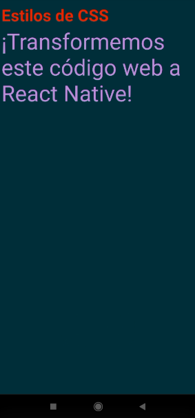

# Sesión 3 - Layouts, responsividad, y adaptabilidad de UI

En está sesión se hicieron prácticas del uso de flexbox y de distintos layout.

## [flexbox](https://developer.mozilla.org/es/docs/Web/CSS/CSS_Flexible_Box_Layout/Basic_Concepts_of_Flexbox)

Es un módulo de diseño de CSS3 que se creó para mejorar la forma en la que se hace diseño responsive. 

### Ejemplos realizados en clase

## Layout