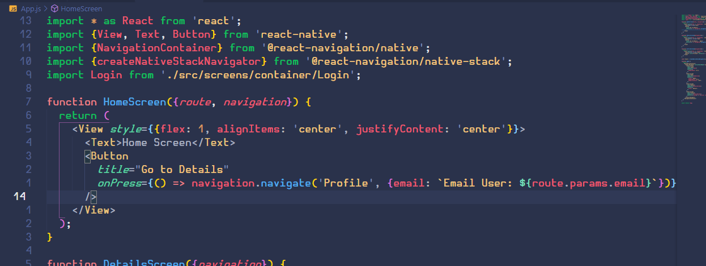

# Navegación con react navigation  

## Revisión de [React Navigation](https://github.com/react-navigation/react-navigation)

### Instalación

cd react-navigation && example && yarn start

## Ejemplo 2

## Reto 1

Mostrar pantalla de Home sin título.

## Ejemplo 3

## Reto 2

Pasar del Login al Profile el email

## Agregando librerias 

- [@react-navigation/native]() - 
yarn add @react-navigation/native

- [react-native-screens]() -

yarn add react-native-screens

- [react-native-screens]() -

yarn add react-native-safe-area-context

- [@react-navigation/native-stack]() - 

yarn add @react-navigation/native-stack

- [react-native-gesture-handler](https://github.com/software-mansion/react-native-gesture-handler#readme) - React Native Gesture Handler proporciona API de gestión de gestos nativas para crear las mejores experiencias táctiles posibles en React Native

yarn add react-native-gesture-handler

- [react-native-loading-spinner-overlay]() - Usado para mostrar loading

yarn add react-native-loading-spinner-overlay

## Drawer

yarn add @react-navigation/drawer
yarn add react-native-reanimated

## Buenas prácticas mencionadas

- Usar [yarn](https://yarnpkg.com/) - YARN es un gestor dependencias de JavaScript, que está enfocado en la velocidad y la seguridad

## Recomendaciones

 - Enfocarse en las buenas prácticas al aprender.

## Comentarios

- Navegación con react navigation