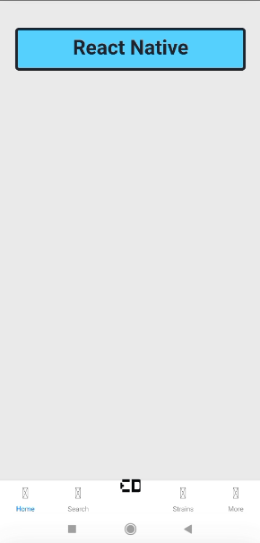

# Uso y manejo de estados

## Instalación de librerias

- [@react-navigation/bottom-tabs](https://reactnavigation.org/docs/bottom-tab-navigator/) - Una simple barra de pestañas en la parte inferior de la pantalla que le permite cambiar entre diferentes rutas.

```
yarn add @react-navigation/bottom-tabs
```

- [react-native-vector-icons]() - Perfecto para botones, logotipos y barras de navegación/pestaña. Fácil de ampliar, diseñar e integrar en su proyecto. 

```
yarn add react-native-vector-icons
```

@react-navigation/compact

## Ejemplo 1


## Reto 1
pantalla lleve a Login

## Reto 1

Ponerle iconos al tab navigation

## git

* git checkout -b <nueva-rama>

## Buenas prácticas

- usar en los nombre de los commit la nomeclatura
  feat (<proyectos>): <descripción>
  o
  fit (<proyecto>): <descripción>
- Usar [gitignore](https://gitignore.io/)

## README con los archivos con los reduces
## Postwork

agregar iconos
cambiar estilos
realizar postwork
  revisar tema teorico de la clase
  reto
    crear vista en source/screen/container/creditcard