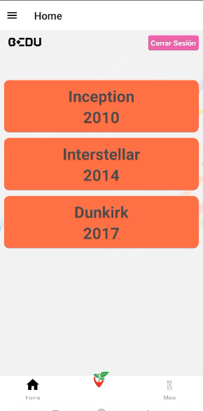
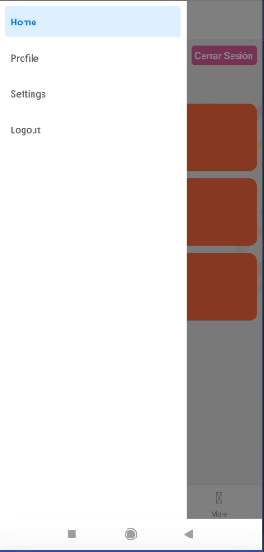

# Consumo de APIs

En esta clase se realizó un repaso de los temas visto en otras clases.

## Preparación de entorno
- descarga de repositorio

git clone

- Creación de rama

git checkout -b <nombre-rama>

- Instalar dependecias

yarn install

- Cargar variables de entorno

source .envrc

## Ejemplo 1 - Navegación

## Uso de imagenes

'''
<Image
  source={require('../../assets/icon/')}
  style={{width: 30, height: 30,}}
/>
'''

## Ejemplo 2 - Cerrar sesión

