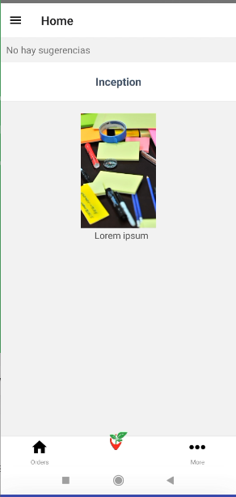

# Debuggeando apps creadas con React native

el objetivo de la clase fue finalizar prototipo de aplicación

## repositorio

git clone https://github.com/igorariza/AppReactNativeCli-Bedu.git

### Componentes agregados

Se agregaron los siguientes componentes:
- Close.js
- ProductDetail.js

Se agregaron las siguientes pantallas
- More.js
- Orders.js

### Reto detalle de producto 

## Consumo de apis

yarn add react-query

## Debuggear
 
 - [Flipper](https://fbflipper.com/) - Flipper lo ayuda a depurar Android, iOS e incluso aplicaciones web que se ejecutan en un emulador/simulador, dispositivos de desarrollo físicos conectados o en su navegador  
 - [Reactotron](https://infinite.red/reactotron#intro) - Inspeccionando sus aplicaciones React JS y React Native.
 - [Sentry](https://docs.sentry.io/platforms/react-native/) - brindar información sobre informes de fallas.